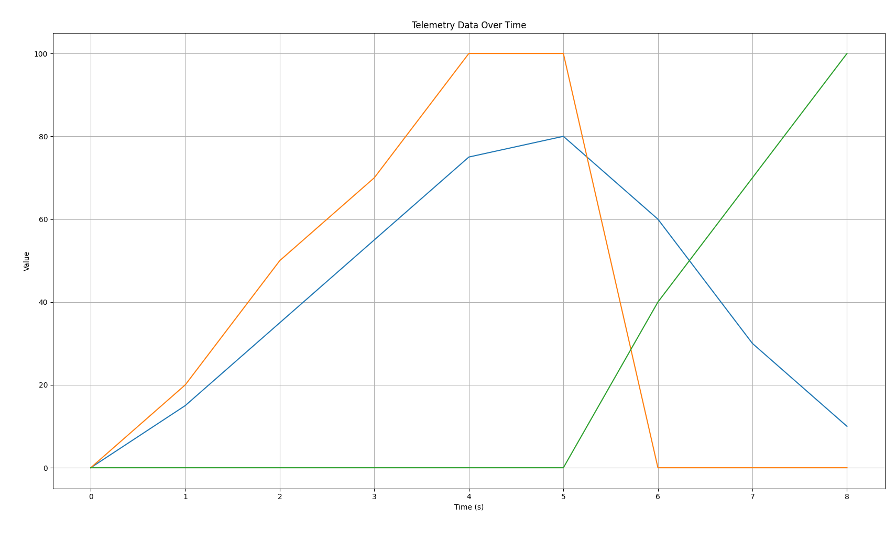

# Motorsport Telemetry Analysis

This project loads, processes, and visualizes simple racing telemetry data using Python.

## Features

Loads telemetry data from a CSV file  
Cleans and verifies column names  
Plots Speed, Throttle, and Brake over time  
Calculates max speed and average throttle  
Exports summary statistics to a CSV file

## Example Output

**Max Speed:** 80.00 kph  
**Average Throttle:** 37.78%

## How to Run

1. Install Python 3.
2. Install dependencies:
3. Place your telemetry CSV file in the same folder.
4. Run the script:

## Files

- `main.py`: Main analysis script.
- `telemetry.csv`: Sample telemetry data.
- `summary.csv`: Output summary statistics.
